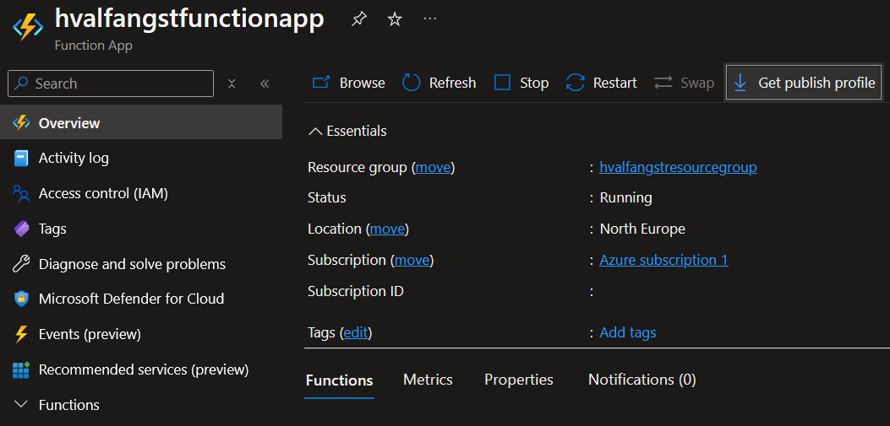

# Python API integrated with Azure Service Bus Queue

## Requirements

- **Platform**: x86-64, Linux/WSL
- **Programming Language**: [Python 3](https://www.python.org/downloads/)
- **Cloud Account**: [Azure](https://azure.microsoft.com/en-us/pricing/purchase-options/azure-account)
- **Resource provisioning**: [Azure CLI](https://learn.microsoft.com/en-us/cli/azure/)


## Allocate resources

The shell script [allocate_resources](infra/allocate_resources.sh) creates Azure resources by calling the Azure CLI, which in turn
makes HTTP calls to the resource-specific API on Azure. 

It will create the following hierarchy of resources:

```mermaid
graph TD
    A[Subscription]
    A --> B[Resource Group]
    B --> C[Storage Account]
    C --> D[Blob Container]
    B --> E[App Service Plan]
    E -->|Hosts| G[Function App]
    G -->|Uses| F[Application Insights]

    A -->|Contains| B
    B -->|Contains| C
    C -->|Contains| D
    B -->|Contains| E
    B -->|Contains| F
```

For this script to work it is necessary to have a configuration file named **infra_config.env** in your [infra](infra) directory. It contains sensitive information
such as tenant and subscription id as well as information used to reference resources. The file has been added to our [.gitignore](.gitignore) so that you don't accidentally commit it.
### Structure of 'infra/infra_config.env'
```bash
TENANT_ID={TO_BE_SET_BY_YOU_MY_FRIEND}
SUBSCRIPTION_ID={TO_BE_SET_BY_YOU_MY_FRIEND}
LOCATION=northeurope
RESOURCE_GROUP_NAME=hvalfangstresourcegroup
STORAGE_ACCOUNT_NAME=hvalfangststorageaccount
BLOB_CONTAINER_NAME=hvalfangstblobcontainer
FUNCTION_APP_NAME=hvalfangstfunctionapp
SERVICE_PLAN_NAME=hvalfangstserviceplan
APP_INSIGHTS_NAME=hvalfangstappinsights
```

## Deallocate resources

The shell script [deallocate_resources](infra/deallocate_resources.sh) deletes our Azure service bus queue, namespace and resource group.

# CI/CD

A CI/CD pipeline for deploying our [Function App](hvalfangst_function/function_app.py) to Azure has been set up using a GitHub Actions workflows [script](.github/workflows/deploy_to_azure.yml). The pipeline is either triggered by a push to the main branch or by manually running the workflow. 
In order for the pipeline to work, the following secrets must be set in the repository settings:


The associated values of the aforementioned secret can be retrieved from the Azure portal, under our deployed Function App.
Click on the **Get publish profile** button and copy/paste the file content into the secret value field.

